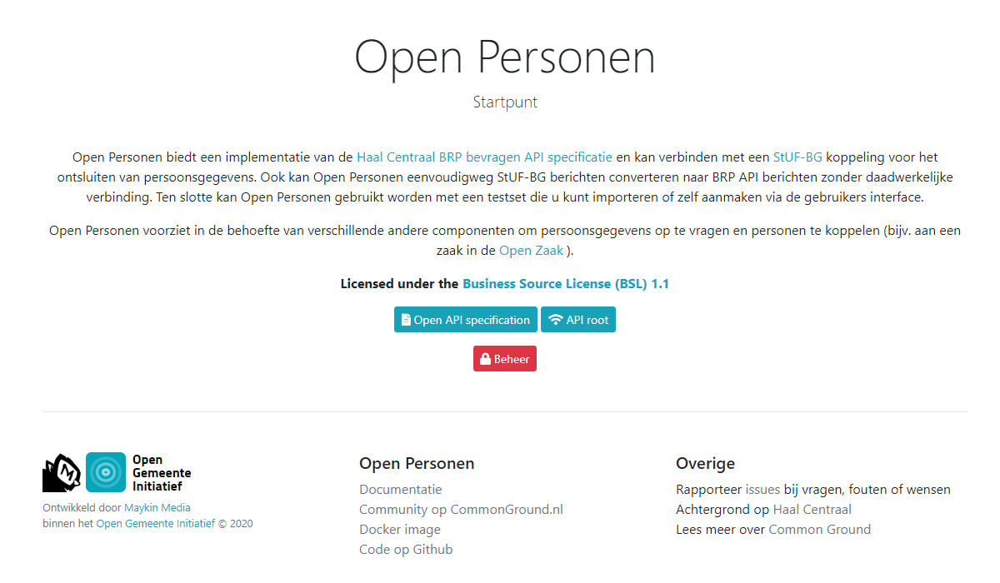

.. _introduction_index:

Introduction
============

Open Personen offers an implementation of the 
`Haal Centraal BRP bevragen API specification`_ and can connect to a `StUF-BG`_ 
service to retrieve personal data. In addition, Open Personen can simply convert
StUF-BG messages to BRP API messages without an actual connection. Finally, you 
can use Open Personen with a test set that you either import or construct 
yourself via the user interface.

Open Personen meets the need for several other components to request personal 
data and to link persons (e.g. to a zaak in the `Open Zaak`_).

The project is designed line with the `Common Ground`_ model and works well 
with other API's and components in this model.

.. _`Haal Centraal BRP bevragen API specification`: https://github.com/VNG-Realisatie/Haal-Centraal-BRP-bevragen
.. _`StUF-BG`: https://www.gemmaonline.nl/index.php/Sectormodel_Basisgegevens:_StUF-BG
.. _`Open Zaak`: https://open-zaak.readthedocs.io/
.. _`Common Ground`: https://commonground.nl/

.. toctree::
   :maxdepth: 1
   :caption: Further reading

   source-code/index
   source-code/why-bsl
